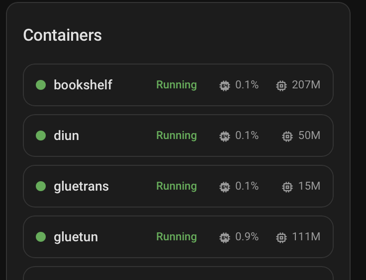

# Portainer Containers Card

A custom Home Assistant Lovelace card that displays Docker containers managed by the [Portainer integration](https://www.home-assistant.io/integrations/portainer/).



## Features

- Auto-discovers all Portainer containers via the HA device registry
- Displays container name, state, CPU usage, and memory usage
- Color-coded status indicators (green = running, red = exited, orange = paused)
- Click a container to open the Home Assistant more-info dialog
- Handles entity ID suffixes (`_2`, `_3`, etc.) gracefully

## Installation

### HACS (Recommended)

1. Open HACS in your Home Assistant instance
2. Click the three-dot menu in the top right and select **Custom repositories**
3. Add `https://github.com/kaymyst/ha-portainer-ui` with category **Dashboard**
4. Click **+ Explore & Download Repositories** and search for **Portainer Containers Card**
5. Click **Download**
6. Restart Home Assistant

### Manual

1. Download `portainer-containers-card.js` from the [latest release](https://github.com/kaymyst/ha-portainer-ui/releases/latest)
2. Copy it to your Home Assistant `config/www/` directory
3. In your HA dashboard, go to **Settings → Dashboards → three-dot menu → Resources**
4. Add resource: `/local/portainer-containers-card.js` with type **JavaScript Module**

## Configuration

Add the card to your dashboard:

```yaml
type: custom:portainer-containers-card
title: Containers
```

### Options

| Option | Type | Default | Description |
|--------|------|---------|-------------|
| `title` | string | `Containers` | Card title |

## Requirements

- Home Assistant with the [Portainer integration](https://www.home-assistant.io/integrations/portainer/) configured
